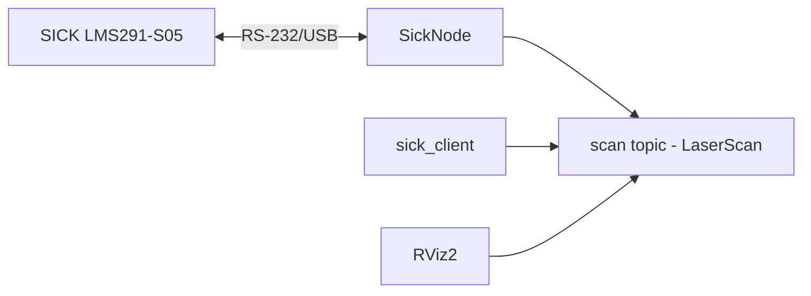

# SICK LMS291-S05 ROS 2 Driver

## TODOs
- [ ] Sería genial poder coger directamente los valores .yaml para la simulación sin tener que tenerlo duplicados en el archivo de gazebo con validación.
- [ ] Revisar y adecuar la documentación.
- [ ] Calcular la altura del haz respecto a su base para ajustar el urdf.
- [ ] Ajustar la masa y el momento de inercia.
- [ ] Volver a testear con el hardware real y el rviz, será necesario hacer el urdf para el hardware real.
- [ ] Obtener los valores de ruido gaussiano para hacer más realista la simulación según -> http://sdformat.org/spec?ver=1.8&elem=sensor#sensor_lidar

NOTA: De momento, no hay soporte para LIDARs en el paquete ROS2 Control.


Este repositorio contiene el código fuente, documentación, CADs y drivers necesarios para integrar y utilizar el sensor **SICK LMS291-S05** en un entorno **ROS 2**. El objetivo principal es disponer de un **driver estable y funcional** en ROS 2, basado en **SickToolbox** y adaptado para versiones modernas de Linux y ROS.

🔑 **Resumen del contenido:**
- 📂 **Estructura del repositorio**: organización de código, ejemplos, launch files, parámetros, rviz y documentación oficial.  
- ⚙️ **Instalación**: pasos para compilar e instalar SickToolbox (con parche para Ubuntu 22.04).  
- 🚀 **Ejemplos incluidos**: cómo ejecutar pruebas básicas con la librería.  
- 🌐 **Driver ROS 2**: instrucciones para clonar, compilar, configurar `/dev/sick`, y lanzar el nodo/cliente en ROS 2.  
- 📡 **Comunicación con el sensor**: limitaciones por RS‑232 (38400 baud, 5–10Hz) y mejora con RS‑422 (500k baud, 75Hz).  
- 📋 **Detalles técnicos**: parámetros YAML, topics publicados (`/scan`), mensaje `LaserScan` explicado.  
- 📚 **Dependencias requeridas**: ROS 2 core, sicktoolbox, build tools, testing.  
- 🔧 **Consideración futura**: integración con `ros2_control`.  
- ✅ **Conclusiones**: estado actual, limitaciones y mejoras recomendadas.  
- 🔗 **Recursos útiles**: referencia REP‑103 y manuales incluidos.  

---

## 📑 Contenido del Repositorio

```
caddy_ai2_sensors_SICK_LMS291-S05/
├── CMakeLists.txt          # Sistema de construcción CMake
├── package.xml             # Definición del paquete ROS2
├── README.md               # Documentación principal
├── src/                    # Código fuente
│   ├── sick_node.cpp       # Nodo principal del driver
│   └── sick_client.cpp     # Cliente de prueba (subscriber /scan)
├── params/                 # Archivos de configuración
│   └── sick.yaml           # Parámetros ROS2 del sensor
├── launch/                 # Archivos de lanzamiento
│   ├── sick_launch.py      # Launch principal ROS2
│   └── sick.py             # Launch alternativo (legacy)
├── startup/                # Scripts de inicialización udev
│   └── initenv.sh          # Alias /dev/sick y permisos
├── rviz2/                  # Configuración de visualización
│   └── config.rviz         # Configuración personalizada en RViz2
└── docs_official/          
    ├── CAD/                # Modelos 3D del sensor (STP, IGS, SLDASM)
    ├── code/               # Sicktoolbox original y parcheado
    ├── manuals/            # Manuales técnicos y guías
    └── *.pdf               # Documentación oficial
```

---

## ⚙️ Instalación del Driver SickToolbox

El sensor utiliza la librería **SickToolbox** como backend de comunicación.\
En este repositorio ya se incluye una versión **parchada para Ubuntu 22.04 LTS**.

### Pasos de instalación:

```bash
cd doc/code/sicktoolbox-1.0.1-patch/
./configure
find . -type f -name Makefile -exec sed -i.bak 's/CXXFLAGS = -g -O2/CXXFLAGS = -g -O2 -std=c++11 -w/g' {} +
make
sudo make install
```

El parche aplicado permite compilar en distribuciones actuales de Linux.

---

## 🚀 Ejecución de Ejemplos SickToolbox (modo nativo)

Los manuales incluidos (ej. `manuals/sicktoolbox-quickstart.pdf`, pág. 13) describen varios ejemplos funcionales.

### Ejemplo: escaneo parcial

```bash
cd docs_official/code/sicktoolbox-1.0.1-patch/c++/examples/lms/lms_partial_scan/src
sudo ./lms_partial_scan /dev/ttyUSB0 38400
```

> **Nota:** ajustar el puerto `/dev/ttyUSB0` según el dispositivo USB real.

### Configuración del sensor

```bash
cd docs_official/code/sicktoolbox-1.0.1-patch/c++/examples/lms/lms_config/src
sudo ./lms_config /dev/ttyUSB0 38400
```

---

## 🌐 Driver ROS 2

El driver ROS 2 está inspirado en el de [YDLIDAR](https://github.com/YDLIDAR/ydlidar_ros2), adaptado al **SICK LMS291-S05**.

### 📦 Instalación y compilación

1. Dirígete a tu workspace de ROS 2.

2. Clona este repositorio dentro de `src/`:

```bash
git clone https://github.com/racarla96/caddy_ai2_sensors_SICK_LMS291-S05.git
```

1. Compila el workspace:

```bash
colcon build
```

1. Crea alias `/dev/sick` para el puerto serie:

```bash
cd caddy_ai2_sensors_SICK_LMS291-S05/startup
sudo chmod 777 initenv.sh
sudo sh initenv.sh
```

Verifica con:

```bash
ls -la /dev/ | grep sick
```

---

## ▶️ Ejecución

### 1\. Nodo directo + cliente de prueba

```bash
ros2 run sick sick_node
ros2 run sick sick_client
```

### 2\. Con lanzamiento (launch)

```bash
ros2 launch sick sick_launch.py
```

Ahora, en `rviz2` puedes visualizar el `LaserScan` publicado en el topic `/scan`.

---

## 📡 Comunicación con el Sensor

* **Interfaz física:** RS-232 a USB (convertidor incluido).

* **Puerto:** `/dev/ttyUSB0` (o alias `/dev/sick`).

* **Velocidad (baud):** 38400 (limitado por convertidor RS-232).

* **Frecuencia máxima actual:**

  * 5 Hz → resolución de **0.5°**

  * 10 Hz → resolución de **1°**

### Limitaciones

* El convertidor USB limita el **baudrate**.

* Máximo aprovechamiento actual: **10 Hz**.

### Posible mejora

Con un convertidor **RS‑422 a USB**, se podría aumentar el baudrate hasta **500 000**, lo que desbloquearía:

* **Resolución 0.25°**

* **Frecuencia hasta 75 Hz**

---

## 🧩 Arquitectura del Paquete ROS2



---

## 📋 Detalles Técnicos del Driver

* **Nodo principal (`sick_node.cpp`)**

  * Inicialización del sensor

  * Lectura de rangos cm → metros

  * Publicación en `sensor_msgs::msg::LaserScan`

  * Configuración por parámetros (port, baudrate, resolución, etc.)

* **Cliente (`sick_client.cpp`)**

  * Suscripción a `/scan`

  * Impresión en consola de valores convertidos

### ✔️ Parámetros configurables (`params/sick.yaml`)

```yaml
sick_node:
  ros__parameters:
    port: "/dev/ttyUSB0"
    frame_id: "laser_frame"
    baudrate: 38400
    resolution: 1.0          # opciones: [0.25, 0.5, 1.0]
    angle_max: 90.0
    angle_min: -90.0
    max_range: 80.0
    min_range: 0.01
    frequency: 10.0
```

### Mensaje `/scan`

* Tipo: `sensor_msgs::msg::LaserScan`

* Campos:

  * `angle_min = -90°` → `-1.57 rad`

  * `angle_max = 90°` → `1.57 rad`

  * `angle_increment = resolución configurada`

  * `ranges = distancias en metros`

  * `scan_time = 1 / frecuencia`

---

## 📚 Dependencias

* **ROS 2 Core**

  * `rclcpp`

  * `sensor_msgs`

  * `geometry_msgs`

  * `visualization_msgs`

* **Sistema**

  * `sicktoolbox-1.0.1-patch` (incluido)

  * Compilador C++14+

* **Construcción**

  * `ament_cmake`

* **Testing**

  * `ament_cmake_gtest`

  * `ament_lint_auto`

---

## 🔧 Integración con ros2_control (futuro)

Actualmente el driver funciona **independiente** (publisher simple).\
Para un sistema complejo se recomienda:

1. Crear **hardware_interface** para ros2_control.

2. Exponer el láser como un dispositivo gestionado.

3. Configurar controladores específicos tipo _sensor_.

4. Validar integración dentro de un stack robótico mayor.

---

## ✅ Conclusiones

* Este driver permite usar el **SICK LMS291-S05** en **ROS 2** de forma estable.

* Está **testeado en Ubuntu 22.04 LTS** con ROS 2 Humble.

* Ofrece configuración dinámica y visualización directa en RViz2.

### Limitaciones actuales

* Velocidad máxima: **10 Hz**

* Resolución mínima: **0.5°**

* Restricción impuesta por hardware (RS‑232/USB)

### Mejora recomendada

* Migrar a convertidor **RS‑422 a USB**, permitiendo **500 000 baud**, **75 Hz** y mejor resolución.

---

## 🔗 Recursos Útiles

* [REP 103 (Unidades y convenciones ROS)](https://www.ros.org/reps/rep-0103.html)

* SickToolbox Quickstart (en `manuals/sicktoolbox-quickstart.pdf`)
